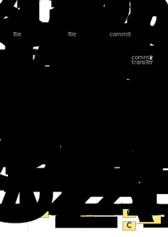
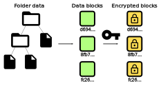
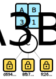
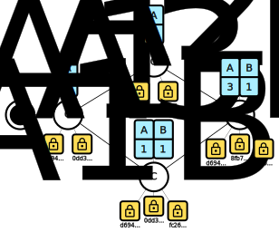

% OuiSync
% eQualitie
% September 2020

# Introduction

The OuiSync project aims to provide users with a friendly tool to synchronize folders with files between their own devices or those of other users (either trusted or untrusted), while keeping the data private and secure both in transit and in rest, and all that in spite of poor or spotty connectivity between devices and without the need of dedicated servers or even local network infrastructure.

OuiSync implements a distributed protocol for the exchange and synchronization of file changes that allows it to use automatic merge strategies and simple conflict resolution propagation, thus sparing users from manual or low-level handling of synchronization issues. Old versions of data may be kept, with user-configurable granularity.

OuiSync uses strong encryption when communicating with other devices to protect from eavesdropping and tampering; data is also only propagated to devices selected for storage to enhance privacy, and then only an allowed subset can access the actual files and metadata. When storing data permanently, OuiSync also uses strong encryption that protects it in case of device seizure.

Communications between devices in OuiSync are resistant to interference thanks to technologies developed for the [Ouinet][] project. Peer-to-peer (P2P) techniques are used for the discovery of other devices and communication with them without the need of a server. Local discovery allows devices to talk directly over a (maybe isolated) local network. If no network is available at all, direct device-to-device (D2D) communication is used instead.

[Ouinet]: https://github.com/equalitie/ouinet/
    "Ouinet (GitHub)"

# Design requirements

OuiSync caters to users who want to keep, for availability or backup purposes, copies of a set of files synchronized between different devices be them their own, or belonging to other users.

Users may prefer to trust some of these devices (like an encrypted smartphone or desktop computer) to access, modify and share file data, while they may only trust other devices (like a permanently online Raspberry Pi or virtual private server) to blindly store and convey data to others.

Moreover, users want the system to behave in a way which is respectful with their privacy, secure, and available despite limited network connectivity.

The previous requirements are in contrast with the majority of existing solutions, where some of the following issues arise:

  - Users rely on third-party providers running servers which can access file data and become a bottleneck and single point of failure, surveillance or control of the system.
  - Other devices need good network reachability (e.g. static IP address, port-forwarding router) or they have to resort to dedicated rendez-vous or tunneling helper servers.
  - Devices need network connection to the outside world even if they are physically close to each other.
  - All devices keeping copies of the data have access to their content.
  - Users need to adopt ad hoc workarounds (like encrypted file system layers or archive files) to keep data private, breaking the usability of the system.
  - Conflicting modifications are handled in a user-unfriendly way (if supported at all).
  - Services, protocols and tools are proprietary or closed source, thus an inherent security liability.

In addition, OuiSync strives to fulfill its requirements in a user-friendly and accessible way, providing end-user tools ready to be used in the main mobile and desktop platforms. All protocols are open and software is released under Free/Libre and Open Source Software licenses.

# Usage scenarios

## Backup device

In this case, Alice has an encrypted smartphone that she uses to read work documents and take pictures of her journeys. She travels a lot and she worries that she might lose the phone and thus the files in it, but she does not want to reveal her files to untrusted third parties. Sitting in a drawer at home she also has an old Raspberry Pi that she used to watch videos on her TV.

So she uses OuiSync to create two **folders** in her phone: one with *Documents* and another with *Voyage pictures*. Their data is encrypted outside her OuiSync application. She connects the Pi (whose SD card has much unused space) permanently to the router, installs OuiSync and creates one **safe** for each folder in the phone (so that now there are two **replicas** of each folder). The Pi has no storage encryption but it is not a risk to Alice since OuiSync safes only see encrypted data and have no cleartext access to file data nor metadata.

Now every time that Alice goes online with her phone, modifications to the folders (like added pictures) are exchanged peer-to-peer as encrypted data with the Pi and stored locally. OuiSync at the Pi keeps some history of changes, so Alice can safely remove old pictures from the phone or recover accidentally modified files.

{width=20%}

## File sharing

Alice wants to share her *Voyage pictures* folders with Bob so that he can see the pictures and add more that he took with his camera when traveling together. So Bob installs OuiSync in his computer and configures a folder to synchronize with Alice's. Bob's device retrieves encrypted data both from Alice's phone and Pi peer-to-peer, so he's able to decrypt and access files in the folder after a while. When he adds new files, encrypted data is retrieved by the other devices as well, so the files become available in Alice's phone.

Since Alice's Pi is online all the time, it does not matter that Alice's and Bob's devices are not simultaneously online. Changes received by the Pi when either one of the devices is online end up being propagated to the other one when it gets connected.

{width=60%}

## Storage incentives

The connection of Alice's home Pi is not specially robust, and now that Bob is adding his very high-quality camera pictures to the shared folder, it becomes quite clear that the Pi will soon run out of storage. So Alice and Bob start looking for bigger, more reliable alternative backup storage.

Charlie offers himself to host a OuiSync safe for them in one of his virtual servers in exchange for a small monthly payment. The servers have reliable and fast connections with plenty of storage space, so Alice and Bob accept the offer and together with Charlie they configure the new safe. When it comes online, it automatically starts gathering encrypted data from Alice's and Bob's devices, so it ends up with a copy of all data (but it still has no cleartext access to the files themselves).

Should Alice and Bob decide that they no longer want to use Charlie's services, they only need to find an alternative place to setup a new safe and let it replicate all of the folder's data before removing Charlie's safe.

{width=60%}

## Conflict resolution

To better remember everything about their journey, Alice and Bob start to write some notes in text files that accompany the pictures. They simultaneously start annotating different picture sets. Even if they add or modify different files at the same time, OuiSync has no issues in synchronizing (**merging**) the changes, as long as they affect different files.

However, at one point Alice and Bob start modifying the same file at similar times. In this case, OuiSync may not be able to automatically merge the changes, and a **conflict** arises which may need to be **resolved** by Alice or Bob. This is illustrated in the diagram below. Please note how OuiSync locally keeps changes from divergent replicas until one can decrypt the data and proceed to automatic merge or manual resolution.

{width=40%}

In it, Alice and Bob start with exact replicas of the shared folder. In them, the file named $F$ contains identical data originating from Alice; we will call that initial state $F_{A1}$. The Pi's safe stores the latest **commit** (i.e. versioned set of all encrypted data in the replica) $C_{A1}$, which contains $F_{A1}$. Bob is offline at the moment.

Then Alice modifies $F_{A1}$ locally to obtain $F_{A2}$, which **follows** $F_{A1}$ (shown as $F_{A1} \to F_{A2}$); the new $C_{A2}$ commit associated with the change is only noticed and obtained by the Pi's safe, which is always online.

While offline, Bob also modifies $F_{A1}$ locally to obtain $F_{A1B1}$, creating commit $C_{A1B1}$. Then he goes online, so Alice and the Pi both obtain Bob's $C_{A1B1}$, while Bob obtains Alice's $C_{A2}$.

The OuiSync protocol allows the Pi's safe to see that $C_{A1B1}$ follows $C_{A1}$, but it does not necessarily follow $C_{A2}$, so it keeps both (as they may be conflicting, something it cannot tell without access to unencrypted data). Each of Alice's and Bob's folders also sees that the other's commit does not necessarily follow its own latest one, but it can also see that both commits affect the same file; thus this file is marked as being in conflict and the other's latest file is kept to help resolve it.

Alice sees OuiSync's notification about the conflict and reworks her file so that it also contains the changes that Bob added (also available from OuiSync), thus creating $F_{A3B1}$. The resulting $C_{A3B1}$ commit is obtained by Bob and the Pi. They both see that this does indeed follow all the latest commits that they know, so it cannot create a new conflict. Bob's device also recognizes $F_{A3B1}$ as following both $F_{A2}$ and $F_{A1B1}$, so the conflict gets automatically resolved there.

Finally, at a later time Alice or Bob may choose to drop old copies of files in their replicas of the shared folder and save some disk space. For instance, some intermediate **folder snapshots** may be removed (i.e. leaving a more coarse granularity of folder history, as shown for Alice), or just the latest copies of files be left (as shown for Bob). Snapshots cannot be removed from safes like the Pi, since they have no cleartext access to file data nor metadata, but oldest commits can be purged instead. In all cases, encrypted data which is no longer used by the remaining commits is dropped.

# Design decisions

## Synchronization mechanism

OuiSync uses [version vectors][version vector] to track changes to the different replicas of a shared folder. The latest commit of each replica is made available to other replicas as a **version vector** and its associated **encrypted data**. The comparison of such vectors allows a replica to decide whether a commit strictly precedes its own, strictly follows it, or does not necessarily follow it (in which case there may be a conflict). Commits stand on their own and do not explicitly point to others. All of this allows the different replicas to:

 1. Efficiently incorporate changes from other replicas in the absence of conflicts. This is done by retrieving missing encrypted **blocks** from other replicas.
 2. Independently modify files in the folder.
 3. Detect potential conflicts and (in end-user replicas) apply automatic merge strategies, or otherwise signal conflicts in particular files (while still allowing updates and modifications).
 4. Keep or drop arbitrary commits from storage without breaking other commits.

[version vector]: https://en.wikipedia.org/wiki/Version_vector
    "Version vector (Wikipedia)"

## Transport protocols

When trying to enable communication between two devices without the need of a mediating server, it is necessary to resort to peer-to-peer (P2P) techniques.

OuiSync uses protocols developed for [Ouinet][], which offer additional protections against network interference by cleverly using industry standards like BitTorrent's distributed hash table (DHT) for the discovery of remote devices, and the [uTP][] transport protocol for NAT-friendly bandwidth-efficient communication between them. Ouinet protocols also include the use of [UPnP][] to make devices more reachable when possible, and multicast to discover other devices in local area networks.

[Ouinet]: https://github.com/equalitie/ouinet/
    "Ouinet (GitHub)"
[uTP]: https://en.wikipedia.org/wiki/Micro_Transport_Protocol
    "Micro Transport Protocol (Wikipedia)"
[UPnP]: https://en.wikipedia.org/wiki/Universal_Plug_and_Play
    "Universal Plug and Play (Wikipedia)"

OuiSync also supports direct device-to-device (D2D) communication in the absence of network infrastructure. The technology choices include [Wi-Fi Direct][] and Bluetooth, which are pervasive in mobile devices.

[Wi-Fi Direct]: https://en.wikipedia.org/wiki/Wi-Fi_Direct
    "Wi-Fi Direct (Wikipedia)"

## Storage

One key feature of OuiSync is that folder data is never stored nor sent to other devices in the clear, not even for synchronization purposes. This provides protection against the device being seized and allows having safes, i.e. replicas which can participate in the synchronization process while not being able to see the actual exchanged contents of the folder.

A storage technology is needed which allows for data and metadata encryption while working with blocks that are amenable to efficient exchange over the network. We found [CryFS][] and its use of [AES][] encryption to fulfill these needs and allow tight integration into our system.

[CryFS]: https://www.cryfs.org/
[AES]: https://en.wikipedia.org/wiki/Advanced_Encryption_Standard
    "Advanced Encryption Standard (Wikipedia)"

To ensure a good usability of OuiSync as day-to-day storage, a method is needed to provide access to shared folders as normal directories in the file system. [FUSE][] offers this possibility in desktop systems.

[FUSE]: https://en.wikipedia.org/wiki/Filesystem_in_Userspace
    "Filesystem in Userspace (Wikipedia)"

# Commit synchronization

Many of the properties of OuiSync stem from the way a folder and its evolution are represented and exchanged.

## Data, blocks and version vectors

Raw folder data (i.e. file contents) as well as metadata (directory tree, file and directory names, sizes, time stamps) are encoded into fixed-size immutable blocks, then these blocks are encrypted with a key (shared between the different end-user replicas which have access to the data), with blocks being given random, unique and immutable identifiers on creation. This encoding and encryption is handled by [CryFS][].

{width=40%}

The state of a folder in a particular end-user replica at a given point in time is represented as the set of encrypted blocks in use at that moment. That set is tagged with a [version vector][] which names the last known version of the folder for each end-user replica known by this one (including itself).

{width=20%}

## Commits, ordering and branches

Given that explanation, the following definitions are used:

  - **Replica identifier (RID):** A UUID uniquely identifying an end-user replica (safes have no RID).
  - **Version:** A 64-bit unsigned integer.
  - **Version vector:** A map from replica identifier to version. The absence of a particular RID/version pair in the map is equivalent to having an entry for that RID in the vector with a version equal to zero.
  - **Block identifier (BID):** An array of 16 completely random bytes uniquely identifying a block.
  - **Encrypted block:** An array of 32 KiB worth of encrypted data.
  - **Encrypted data:** A map from block identifier to encrypted block.
  - **Commit:** A pair of version vector and encrypted data. We use the notation $C_{VersionVector}$ to indicate the commit tagged with that version vector, e.g. $C_{A1B2}$ for the commit with a version vector where replica *A* (a shorthand for its UUID) has version 1 and replica *B* has version 2.

By having a version vector associated with each commit, any commit $C_x$ can be compared to any other commit $C_y$ as being either:

  - **Identical:** $C_x = C_y$ (commutative: $C_y = C_x$)
  - **Preceding:** $C_x < C_y$ (transitive: if $C_x < C_y$ and $C_y < C_z$ then $C_x < C_z$), or $C_x \to C_y$
  - **Following:** $C_x > C_y$ (transitive), or $C_y \to C_x$
  - **Concurrent:** $C_x \parallel C_y$ (commutative: $C_y \parallel C_x$). This can only happen with commits from different replicas.

This implicit, partial ordering of commits allows each replica to create a directed acyclic graph (DAG) view of the commits that it knows from itself and from other replicas, so that:

  - A **branch** is formed by commits which are **ordered**, i.e. for $C_x \neq C_y$ either $C_x < C_y$ or $C_x > C_y$.
  - The **head** of the branch is its latest commit, i.e. for $C_x \neq C_{head}$ in the branch $C_x < C_{head}$.
  - Whenever concurrent commits happen in the branch, a new branch appears in the DAG for each of them, stemming from their common preceding head.
  - A commit following the heads of several branches **resolves** them back into a single branch having that commit as its head.

{width=60%}

The main difference with other DAG-based systems like [Git][] is that there are no explicit pointers to other commits. In contrast with diff-based systems like [Subversion][], each commit is self-contained and includes all references needed to reconstruct its associated data (except for decryption keys). The combination of both features allows the user to *drop arbitrary commits* from their replica (e.g. to progressively reduce the granularity of older backups) and save disk space without invalidating other commits. Thanks to the use of version vectors, the remaining commits maintain their relative order.

[Git]: https://git-scm.com/
[Subversion]: https://subversion.apache.org/

## Commit transfers and conflicts

When working on a shared folder in a single end-user replica, updates to folder data just create new commits that follow the main branch head and become the new one. This causes no problem.

However, when other end-user replicas are added to the equation, the local replica also retrieves new commits from others. Depending on how the remote commit $C_r$ compares to this replica's head $C_h$, different things can happen:

  - If they are equal ($C_r = C_h$), we already have all its data and we can just ignore it.
  - If the remote commit precedes our head ($C_r < C_h$), it is outdated and we may ignore it.
  - If the remote commit follows our head ($C_r > C_h$), we proceed to retrieve whatever encrypted data we lack from that commit. The commit is saved as the new head. If the local replica is an end-user one, it can decrypt the data and update local files if needed.

However, if the remote commit is *concurrent* with our head ($C_r \parallel C_h$), that means that changes to data happened independently in different replicas. Those changes may or may not be compatible, so they may need further inspection. Since there is no way of knowing without unencrypted access to data, the local replica retrieves and stores missing encrypted data from the remote commit.

This is where the story ends for a safe replica. However, an end-user replica can indeed decrypt that data, so it proceeds to check the actual changes to shared folder data:

  - If changes are compatible (e.g. affecting different files), changes are **merged** without user intervention, local files are updated if needed, and a new commit is synthesized which *follows the concurrent commits* and *automatically resolves the branching* caused by the remote commit. The new commit becomes the new head.
  - If changes are not compatible (e.g. changing the same data in a single file), the commits are said to cause a **conflict**. This needs to be handled *manually* by the user.

When a conflict arises, since the end-user replica has access to the data of conflicting commits, it can help the user fix the conflict e.g. by offering access to the versions of the affected files modified by the other replicas so as to show differences. Once the user has manually resolved the issue, a new commit is created that *follows the conflicting commits*, thus *resolving the conflict*. The new commit becomes the new head.

In both branching cases (conflicting and non-conflicting), when the new resolving commit is received by another replica, the commit also resolves the branching there and it becomes the new head, unless that replica already has a branch of commits which follow one of the previously branching commits. In this case, the resolving commit and the head of that branch are still concurrent and the two branches need resolving (either automatic or manual).

{width=60%}

# Appendix: Copyright notices

Material design icons in diagrams are copyright Google, LLC and used under the [Apache License v2.0][].

[Apache License v2.0]: https://www.apache.org/licenses/LICENSE-2.0
